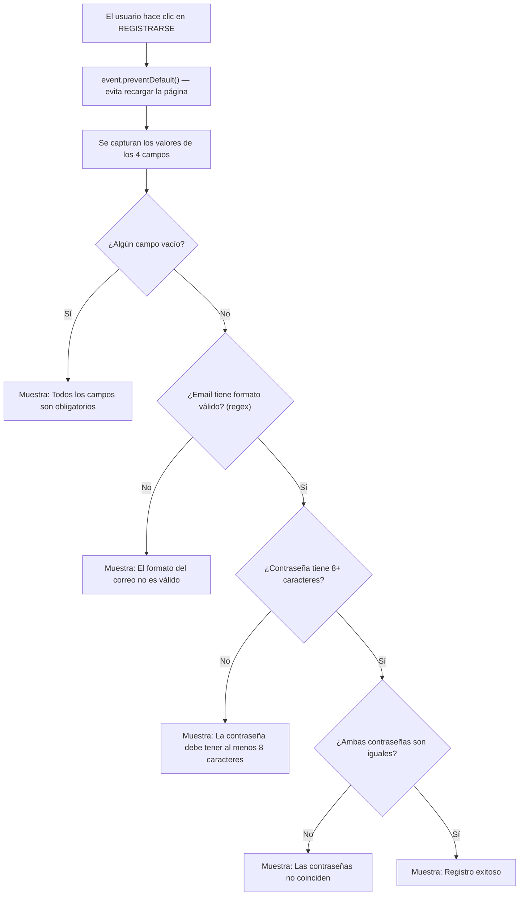
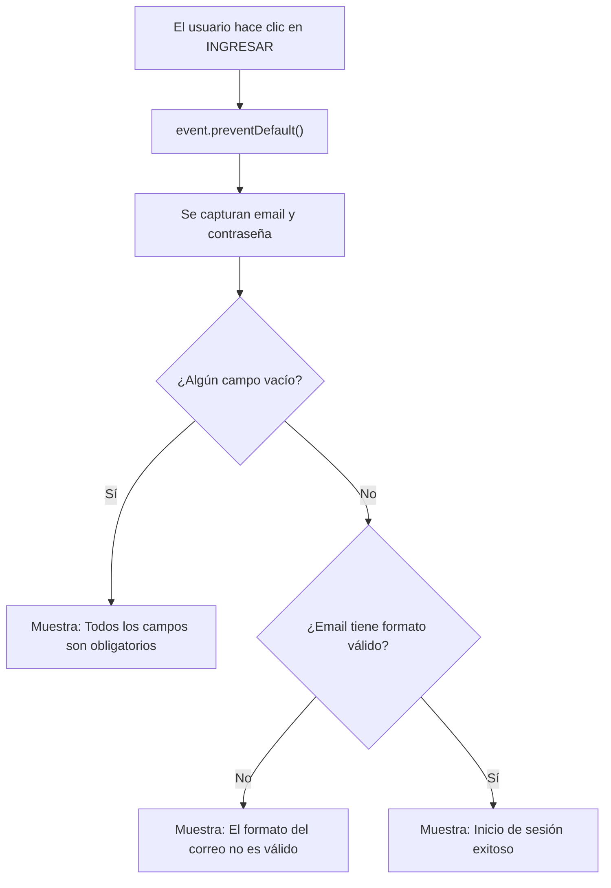
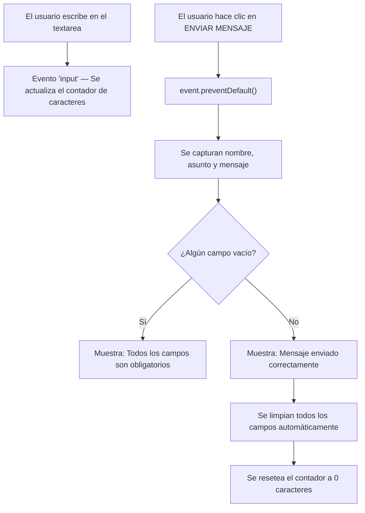

## Resumen de lo que se hizo

Se implementaron **3 formularios funcionales** con validación en JavaScript:

| Formulario | Archivo HTML | Archivo JS | Campos |
|---|---|---|---|
| **Registro** | `registro.html` | `js/registro.js` | Usuario, Email, Contraseña, Confirmar Contraseña |
| **Login** | `login.html` | `js/login.js` | Email, Contraseña |
| **Contacto** | `contacto.html` | `js/contacto.js` | Nombre, Asunto, Mensaje + contador |

---

## Estructura del proyecto

```
web-nueva-con-registro/
├── index.html          ← Página principal (con links a los 3 formularios)
├── registro.html       ← Formulario A: Registro
├── login.html          ← Formulario B: Login
├── contacto.html       ← Formulario C: Contacto
├── css/
│   ├── styles.css      ← Estilos globales (no se tocó)
│   └── registro.css    ← Estilos de formularios (se agregó textarea y contador)
├── js/
│   ├── registro.js     ← Lógica del registro
│   ├── login.js        ← Lógica del login
│   └── contacto.js     ← Lógica del contacto
```

---

## Conceptos clave usados (los que pide el documento)

### 1. `event.preventDefault()`
Cuando un formulario se envía (`submit`), **el navegador recarga la página automáticamente**. Eso borra todo lo que estábamos haciendo. Con `event.preventDefault()` le decimos al navegador: *"No hagas eso, yo me encargo"*. Así podemos validar los datos con JavaScript antes de hacer cualquier cosa.

### 2. `document.getElementById()`
Es la forma de **capturar un elemento del HTML** desde JavaScript. Le pasamos el `id` del elemento y nos devuelve una referencia a él para poder leer su valor, cambiar su texto, etc.

```javascript
var correo = document.getElementById("correoRegistro"); // Captura el input del email
var valor = correo.value; // Lee lo que el usuario escribió
```

### 3. Feedback en tiempo real (errores en pantalla)
En lugar de usar `console.log()` (que solo se ve en la consola del navegador), **mostramos los errores dentro de un elemento `<p>` en la misma página**. El usuario ve el error directamente.

```javascript
mensaje.textContent = "Las contraseñas no coinciden."; // Muestra el error en pantalla
```

---

## Formulario A: REGISTRO — Lógica paso a paso

> [!IMPORTANT]
> Archivo: [registro.js](file:///c:/Users/Iván/Desktop/prouyecto%20con%20registro/web-nueva-con-registro/js/registro.js)

### Flujo de ejecución:



### Sobre la expresión regular (regex) del email:

```javascript
var regexEmail = /^[^\s@]+@[^\s@]+\.[^\s@]+$/;
```

| Parte | Significado |
|---|---|
| `^` | Inicio del texto |
| `[^\s@]+` | Uno o más caracteres que NO sean espacio ni `@` |
| `@` | El símbolo arroba (obligatorio) |
| `[^\s@]+` | Otra vez, caracteres que NO sean espacio ni `@` |
| `\.` | Un punto literal |
| `[^\s@]+` | Más caracteres después del punto |
| `$` | Fin del texto |

**Ejemplo**: `ivan@gmail.com` ✅ — `ivangmail` ❌ — `ivan@.com` ❌

### Sobre la validación de contraseña:

```javascript
if (valorPassword.length < 8) { ... }
```
`.length` devuelve la **cantidad de caracteres** del texto. Si tiene menos de 8, mostramos error.

### Sobre la comparación de contraseñas:

```javascript
if (valorPassword !== valorConfirmar) { ... }
```
`!==` significa **"no es igual a"**. Si la contraseña y la confirmación son diferentes, mostramos error.

---

## Formulario B: LOGIN — Lógica paso a paso

> [!IMPORTANT]
> Archivo: [login.js](file:///c:/Users/Iván/Desktop/prouyecto%20con%20registro/web-nueva-con-registro/js/login.js)

### Flujo de ejecución:



Este formulario es más simple: solo valida que los campos no estén vacíos y que el email tenga formato válido. Si todo está bien, muestra un mensaje de éxito.

---

## Formulario C: CONTACTO — Lógica paso a paso

> [!IMPORTANT]
> Archivo: [contacto.js](file:///c:/Users/Iván/Desktop/prouyecto%20con%20registro/web-nueva-con-registro/js/contacto.js)

### Flujo de ejecución:



### Sobre el contador de caracteres:

```javascript
mensajeTexto.addEventListener("input", function () {
    var cantidadCaracteres = mensajeTexto.value.length;
    contador.textContent = cantidadCaracteres + " caracteres";
});
```

- `"input"` es un evento que se dispara **cada vez que el usuario escribe o borra algo** en el textarea.
- `.value.length` nos da cuántos caracteres tiene el texto en ese momento.
- Actualizamos el `<p>` del contador con ese número.

### Sobre la limpieza automática:

```javascript
nombre.value = "";
asunto.value = "";
mensajeTexto.value = "";
contador.textContent = "0 caracteres";
```

Después de un envío exitoso, **vaciamos todos los campos** asignándoles una cadena vacía `""`. Así el formulario queda listo para un nuevo mensaje.

---

## Cómo explicarlo en clase (guión sugerido)

### Introducción (1 min)
*"Vamos a ver cómo JavaScript interactúa con los formularios HTML. Hay 3 conceptos clave: prevenir el envío por defecto, capturar los valores del DOM, y mostrar errores en pantalla."*

### Concepto 1: `event.preventDefault()` (2 min)
*"Cuando un formulario se envía, el navegador recarga la página. Nosotros usamos `event.preventDefault()` para que NO se recargue y podamos validar los datos primero con JavaScript."*

### Concepto 2: Captura del DOM (2 min)
*"Con `document.getElementById('nombreDelCampo')` obtenemos el elemento HTML. Luego con `.value` leemos lo que el usuario escribió. Es como ir al HTML y preguntar: '¿qué dice este input?'"*

### Concepto 3: Feedback en pantalla (2 min)
*"En vez de mostrar errores en la consola (que el usuario no ve), usamos un `<p>` vacío en el HTML y le cambiamos el texto con `.textContent`. Así el error aparece en la misma página."*

### Demo del Registro (3 min)
*"Miren: si dejo los campos vacíos, aparece 'Todos los campos son obligatorios'. Si pongo un email sin @, dice 'formato no válido'. Si la contraseña tiene menos de 8 caracteres, lo rechaza. Y si las dos contraseñas no coinciden, también lo detecta. Solo cuando TODO está bien, muestra 'Registro exitoso'."*

### Demo del Contacto (2 min)
*"Fíjense en el contador: cada vez que escribo, se actualiza en tiempo real. Eso es el evento 'input'. Y cuando envío exitosamente, los campos se limpian solos."*
